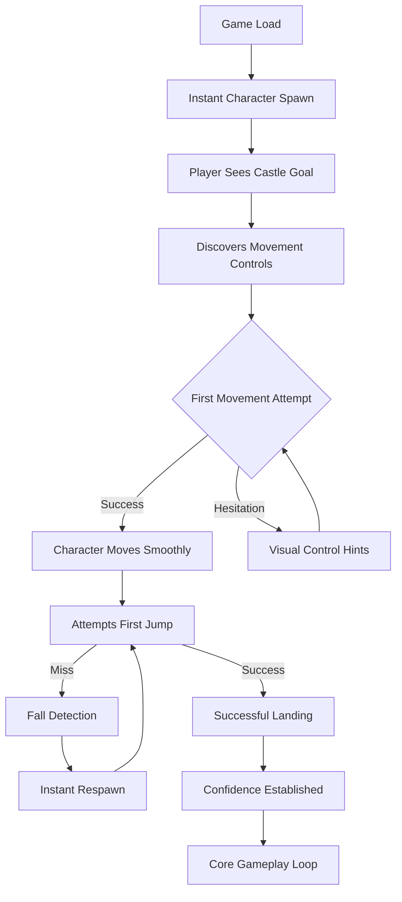
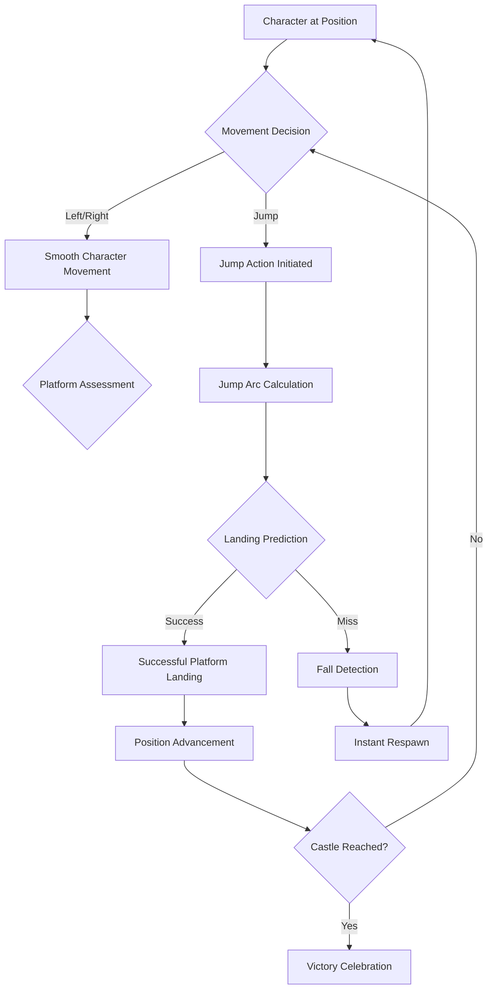
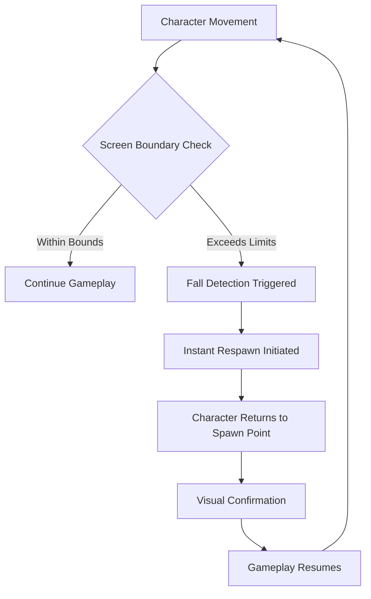

# UX Design Specification bmad-windsurf

**Author:** heschoon
**Date:** 2026-01-28T14:39:00.000Z

---

## Executive Summary

### Project Vision

A minimalist HTML5 platformer game that delivers smooth, responsive gameplay using simple polygon graphics. The project focuses on core mechanics over visual complexity, providing instant playability across desktop and mobile devices with a clean, distraction-free gaming experience.

### Target Users

- **Casual Gamers:** Players seeking quick entertainment without complex learning curves
- **Mobile Users:** Users who want responsive touch controls and adaptive gameplay
- **Desktop Players:** Users who prefer precise keyboard controls for platformer gameplay
- **Minimalist Design Enthusiasts:** Players who appreciate clean, functional aesthetics over detailed graphics

### Key Design Challenges

- **Cross-Platform Input:** Creating intuitive controls that work seamlessly across keyboard and touch interfaces
- **Polygon-Only Visuals:** Designing clear visual feedback and recognizable game elements using only simple geometric shapes
- **Responsive Performance:** Ensuring smooth 60fps gameplay across different screen sizes and device capabilities
- **Instant Playability:** Delivering immediate gameplay without asset loading delays or complex setup

### Design Opportunities

- **Minimalist Aesthetic:** Leveraging polygon-only graphics to create a distinctive, clean visual style that emphasizes gameplay over visuals
- **Performance Optimization:** Using simple graphics to ensure consistent 60fps performance and instant responsiveness
- **Universal Accessibility:** Creating an experience that works equally well on both desktop and mobile without compromising gameplay quality
- **Innovative Visual Language:** Developing creative ways to represent game elements (player, platforms, castle) using only geometric shapes

## Core User Experience

### Defining Experience

The core experience centers on **responsive character control** - the feeling that the player character is an extension of the user's thoughts. Every jump, movement, and interaction should feel immediate, precise, and natural. The game delivers instant playability with zero barriers between player and gameplay.

### Platform Strategy

**Web-Based Cross-Platform Experience:**
- **Desktop Browser:** Keyboard controls (arrow keys + spacebar) with precise input handling
- **Mobile Browser:** Touch-based virtual controls with adaptive sizing and positioning
- **Universal Compatibility:** Modern browser support without plugins or downloads
- **Responsive Design:** Consistent experience across screen sizes and device capabilities

### Effortless Interactions

**Zero-Friction Gameplay:**
- **Instant Play:** No loading screens, menus, or setup - game starts immediately
- **Natural Movement:** Left/right movement and jumping feel intuitive without tutorials
- **Automatic Systems:** Instant respawn after falling, seamless level restart
- **Visual Feedback:** Immediate response to all inputs with clear polygon-based animations

### Critical Success Moments

**Make-or-Break Interactions:**
- **First Jump:** The moment players feel the responsive control system - determines continued engagement
- **Platform Landing:** Successful navigation demonstrates game physics and control precision
- **Castle Reach:** Victory moment that provides accomplishment and sense of completion
- **Fall Recovery:** Quick respawn that maintains momentum and reduces frustration

### Experience Principles

**Guiding UX Framework:**
- **Instant Responsiveness:** Every input should feel immediate and connected to the action
- **Cross-Platform Consistency:** The game should feel equally good on desktop and mobile
- **Minimal Friction:** No loading screens, complex menus, or unnecessary steps between player and gameplay
- **Intuitive Controls:** Players should be able to play successfully without tutorials or instructions

## Desired Emotional Response

### Primary Emotional Goals

**Core Emotional State:** Players should feel **in control and focused**, experiencing a flow state where the character becomes an extension of their thoughts. The game should create a sense of effortless mastery where players feel completely connected to their character's movements.

### Emotional Journey Mapping

**Discovery Phase:** Curiosity and intrigue from the clean minimalist design, immediate confidence from intuitive controls
**Core Gameplay:** Focused absorption in the flow state, complete concentration on movement and timing
**Success Moments:** Pride and accomplishment when reaching the castle, satisfaction in mastering challenges
**Failure Recovery:** Encouragement and motivation from quick respawns, maintained momentum without frustration
**Return Experience:** Comfort and familiarity, like returning to a favorite activity

### Micro-Emotions

**Positive Micro-Emotions to Cultivate:**
- **Confidence:** Players trust their abilities and the game's reliability
- **Trust:** Belief that inputs will be accurately and immediately responded to
- **Excitement:** Anticipation of reaching goals and overcoming challenges
- **Accomplishment:** Pride in successful navigation and skill development
- **Delight:** Surprise and pleasure in smooth, responsive controls

**Negative Micro-Emotions to Minimize:**
- **Frustration:** Reduced through quick respawns and fair challenge design
- **Confusion:** Eliminated through intuitive controls and clear visual feedback
- **Anxiety:** Minimized with predictable physics and consistent behavior
- **Disappointment:** Avoided through achievable challenges and progress indication

### Design Implications

**Emotion-Driven Design Choices:**
- **Control Feeling:** 16ms input response with immediate visual feedback creates empowerment
- **Focus State:** Minimal polygon visuals eliminate distractions and maintain concentration
- **Accomplishment:** Clear castle endpoint and skill-based progression provide satisfaction
- **Confidence Building:** Predictable physics and consistent collision detection build trust
- **Delight Moments:** Smooth animations and perfect jump timing create micro-joys

**Emotion Prevention Strategies:**
- **Frustration Prevention:** Instant respawn maintains momentum and reduces penalty for failure
- **Confusion Elimination:** Single-scene design with clear visual hierarchy
- **Anxiety Reduction:** Fair challenge progression with no sudden difficulty spikes
- **Disappointment Avoidance:** Achievable goals with clear progress indicators

### Emotional Design Principles

**Guiding Emotional Framework:**
- **Flow State First:** Every design choice should support uninterrupted focus and absorption
- **Instant Gratification:** Immediate response to all inputs creates continuous positive feedback
- **Forgiving Progression:** Quick recovery from setbacks maintains emotional momentum
- **Skill Mastery:** Challenges that feel difficult but achievable build genuine accomplishment
- **Minimal Distraction:** Clean design keeps emotional focus on gameplay, not interface

## UX Pattern Analysis & Inspiration

### Inspiring Products Analysis

**Classic Platformer Games (Super Mario, Celeste, Geometry Dash):**
- **Core Success:** Instantly responsive controls that make players feel completely connected to their character
- **Onboarding Excellence:** No tutorials required - players learn through immediate gameplay
- **Delightful Interactions:** Perfect jump timing and satisfying movement physics create micro-joys
- **Visual Clarity:** Character silhouettes and environments are instantly recognizable

**Minimalist Mobile Games (Doodle Jump, Crossy Road):**
- **Zero-Friction Entry:** Games start immediately without menus or loading screens
- **Single-Objective Focus:** Clear goals keep players in flow state without confusion
- **Quick Recovery:** Instant restart maintains momentum and reduces frustration
- **Addictive Loops:** Simple mechanics with mastery potential keep players returning

**Web-Based HTML5 Games:**
- **Instant Accessibility:** No downloads or installations required
- **Cross-Platform Consistency:** Same experience across desktop and mobile browsers
- **Performance Optimization:** Smooth gameplay on various device capabilities
- **Minimal Resource Usage:** Fast loading and responsive even on lower-end devices

### Transferable UX Patterns

**Navigation Patterns:**
- **Instant Start Pattern** - Players begin gameplay immediately without menu navigation
- **Single-Objective Focus** - Clear castle endpoint provides unambiguous goal direction
- **Progressive Difficulty** - Natural skill progression through level design

**Interaction Patterns:**
- **Responsive Jump Mechanics** - 16ms input response creates feeling of direct control
- **Visual Input Feedback** - Polygon animations confirm every player action
- **Quick Respawn System** - Instant return to spawn point maintains gameplay momentum
- **Predictable Physics** - Consistent behavior builds player confidence and trust

**Visual Patterns:**
- **Minimalist Graphics** - Simple polygons eliminate distractions and maintain focus
- **Clear Character Silhouettes** - Distinctive shapes make player instantly recognizable
- **High Contrast Design** - Clear visual hierarchy supports flow state and concentration
- **Smooth Animations** - Fluid movement enhances feeling of control and responsiveness

### Anti-Patterns to Avoid

**Common Platformer Pitfalls:**
- **Complex Menu Systems** - Players want to play, not navigate interfaces
- **Unfair Difficulty Spikes** - Sudden challenge increases create frustration and abandonment
- **Laggy Input Response** - Delayed feedback breaks connection between player and character
- **Asset-Heavy Graphics** - Loading times and complexity distract from core gameplay
- **Confusing Visual Design** - Busy interfaces prevent focus and flow state

**Mobile-Specific Issues:**
- **Poor Touch Controls** - Virtual buttons that don't respond accurately
- **Screen Size Problems** - UI elements that don't scale properly across devices
- **Performance Inconsistency** - Frame rate drops that break gameplay flow

### Design Inspiration Strategy

**What to Adopt:**
- **Instant Play Pattern** - Supports zero-friction core experience and immediate engagement
- **Responsive Control Pattern** - Aligns with 16ms input response requirement and control-feeling goal
- **Minimalist Visual Approach** - Perfect for polygon-only graphics and focus maintenance

**What to Adapt:**
- **Quick Respawn Pattern** - Simplified for single-level structure with instant spawn point return
- **Progressive Difficulty** - Adapted for short demo experience with achievable challenge curve
- **Cross-Platform Consistency** - Modified for browser-based deployment with responsive design

**What to Avoid:**
- **Complex Menu Systems** - Conflicts with instant play goals and minimal friction principles
- **Asset-Heavy Graphics** - Doesn't fit polygon-only requirement and performance goals
- **Unfair Difficulty Design** - Contradicts emotional goals of confidence and accomplishment

## Design System Foundation

### Design System Choice

**Pure CSS + Canvas Approach** - Custom game-specific design system with zero framework dependencies

### Rationale for Selection

**Performance Priority:**
- Zero framework overhead ensures maximum 60fps performance
- Direct control over rendering pipeline for polygon graphics
- No unnecessary abstraction layers between code and canvas

**Visual Control Requirements:**
- Complete freedom for polygon-only graphics implementation
- Precise control over animations and visual feedback
- Custom collision detection and physics visualization

**Project Alignment:**
- Perfect fit for minimalist design goals
- Supports cross-platform responsive design without framework constraints
- Enables instant play with zero loading dependencies

**Technical Considerations:**
- Phaser game engine handles core game rendering
- Pure CSS handles responsive layout and basic UI
- Canvas API provides direct polygon drawing capabilities

### Implementation Approach

**Layer 1: Responsive Layout (Pure CSS)**
- Custom CSS grid for game container positioning
- Viewport-based scaling for cross-platform consistency
- Touch-friendly button sizing for mobile controls

**Layer 2: Game Rendering (Phaser + Canvas)**
- Phaser engine manages game loop and physics
- Custom polygon rendering using Canvas API
- Real-time visual feedback for all interactions

**Layer 3: Game UI Elements (CSS + Canvas Hybrid)**
- CSS for basic layout and positioning
- Canvas for dynamic game elements (health bars, score)
- Responsive touch controls with visual feedback

### Customization Strategy

**Design Tokens System:**
```css
:root {
  --primary-color: #2563eb;
  --secondary-color: #10b981;
  --background-color: #1f2937;
  --text-color: #f3f4f6;
  --polygon-stroke: #ffffff;
  --polygon-fill: #3b82f6;
}
```

**Component Patterns:**
- **Game Container:** Full viewport with responsive scaling
- **Touch Controls:** Adaptive positioning based on device type
- **Visual Feedback:** Immediate polygon animations for all inputs
- **Status Indicators:** Minimal text overlays on game canvas

**Responsive Strategy:**
- **Desktop:** Keyboard-first with minimal UI overlay
- **Mobile:** Touch controls with adaptive sizing
- **Tablet:** Hybrid approach with optional control methods

**Performance Optimization:**
- CSS transforms for smooth animations
- RequestAnimationFrame for 60fps consistency
- Minimal DOM manipulation during gameplay
- Efficient polygon caching and reuse

## 2. Core User Experience

### 2.1 Defining Experience

**"Jump with perfect timing to navigate platforms and reach the castle"**

The defining experience centers on the satisfying feeling of precise character control - where the player character becomes an extension of the user's thoughts. This core interaction captures the essence of platformer gameplay: the flow state of movement, the accomplishment of successful navigation, and the triumph of reaching the goal.

### 2.2 User Mental Model

**Existing Mental Models:**
- **Movement Controls:** Arrow keys (desktop) and touch controls (mobile) for left/right movement
- **Jump Action:** Spacebar (desktop) or dedicated button (mobile) for jumping
- **Physics Expectations:** Gravity-based movement with predictable jump arcs
- **Goal Orientation:** Clear visual endpoint (castle) provides unambiguous objective

**User Expectations:**
- **Immediate Response:** No perceptible delay between input and character action
- **Fair Physics:** Consistent, predictable gravity and collision detection
- **Clear Progression:** Visible path from spawn point to castle endpoint
- **Forgiving Recovery:** Quick respawn after mistakes without harsh penalties

**Potential Frustration Points:**
- Unresponsive controls or input lag
- Unfair collision detection or "cheap deaths"
- Confusing level design with unclear paths
- Excessive punishment for minor mistakes

### 2.3 Success Criteria

**"This Just Works" Indicators:**
- **Instant 16ms Response:** Every input triggers immediate character movement
- **Natural Movement:** Character acceleration/deceleration feels smooth and intuitive
- **Predictable Physics:** Jump arcs and gravity behavior are consistent and learnable
- **Fair Challenge:** Difficulty comes from skill mastery, not unfair mechanics

**Accomplishment Triggers:**
- **Perfect Jump Timing:** Satisfying feeling of nailing difficult jump sequences
- **Flow State:** Complete absorption in movement and navigation
- **Goal Achievement:** Reaching castle endpoint provides clear victory moment
- **Skill Progression:** Visible improvement in control and navigation

**Automatic Systems:**
- **Instant Respawn:** Immediate return to spawn point after falling
- **Smooth Animations:** Continuous visual feedback for all character actions
- **Responsive Physics:** Real-time collision detection and response
- **Cross-Platform Adaptation:** Controls automatically adapt to device type

### 2.4 Novel UX Patterns

**Established Foundation with Innovation:**
The core experience uses **established platformer patterns** that users immediately understand, with innovation in execution quality:

**Proven Patterns Adopted:**
- Arrow key + spacebar control scheme (desktop)
- Touch-based virtual controls (mobile)
- Gravity-based physics and collision detection
- Goal-oriented level design

**Innovation Within Familiar Patterns:**
- **Perfect Response Time:** 16ms input response creates feeling of direct control
- **Polygon-Only Visuals:** Clean, minimalist aesthetic maintains focus on gameplay
- **Cross-Platform Consistency:** Identical gameplay experience across devices
- **Zero-Friction Entry:** Instant play without menus or loading screens

### 2.5 Experience Mechanics

**1. Initiation Phase:**
- **Instant Start:** Game begins immediately upon page load
- **Clear Spawn Point:** Character appears at designated starting position
- **Visible Goal:** Castle endpoint clearly visible from spawn location
- **Control Discovery:** Intuitive control layout requires no tutorial

**2. Interaction Phase:**
- **Movement Input:** Left/right controls with smooth acceleration/deceleration
- **Jump Action:** Dedicated jump input with natural gravity physics
- **Real-Time Feedback:** Immediate polygon animation for every character action
- **Continuous Response:** No input lag or delayed character response

**3. Feedback Phase:**
- **Visual Confirmation:** Character movement and jumping clearly visible
- **Collision Response:** Accurate platform collision with appropriate physics
- **Progress Indication:** Character position clearly shows advancement toward goal
- **Error Recovery:** Fall detection triggers immediate, non-punitive respawn

**4. Completion Phase:**
- **Goal Recognition:** Castle contact triggers clear victory indication
- **Accomplishment Feedback:** Visual celebration of level completion
- **Replay Option:** Instant restart capability for repeated enjoyment
- **Skill Reinforcement:** Successful completion builds confidence for future attempts

## Visual Design Foundation

### Color System

**Performance-Optimized Palette:**
- **Background:** #1a1a2e (Dark) - Creates focus and reduces eye strain during gameplay
- **Player Character:** #3b82f6 (Bright Blue) - Stands out clearly against dark background
- **Platforms:** #4a5568 (Medium Gray) - Visible but doesn't compete with player attention
- **Castle/Goal:** #f59e0b (Gold) - Clear victory destination that draws attention
- **UI Elements:** #ffffff (White) - Maximum contrast for readability and accessibility

**Semantic Color Mapping:**
- **Primary Action:** Player character blue for immediate recognition
- **Interactive Elements:** Platform gray for clear collision boundaries
- **Success/Goal:** Castle gold for positive reinforcement
- **Information:** UI white for maximum legibility
- **Environment:** Background dark for gameplay focus

**Accessibility Compliance:**
- All text elements meet WCAG AA contrast ratios (4.5:1 minimum)
- High contrast between game elements ensures visibility across devices
- Color-blind friendly palette with distinct value differences

### Typography System

**System-First Typography:**
- **Primary Font:** system-ui - Fast loading, native rendering across platforms
- **Secondary Font:** monospace - For score displays and technical UI elements
- **Fallback Stack:** system-ui, -apple-system, BlinkMacSystemFont, "Segoe UI", Roboto

**Minimal Type Scale:**
- **Title (24px):** Game over/victory messages
- **Body (16px):** UI labels and instructions
- **Small (12px):** Score displays and status indicators

**Typography Principles:**
- **Performance Priority:** System fonts eliminate loading delays
- **Readability Focus:** Large font sizes with generous line height
- **Minimal Hierarchy:** Only essential text sizes needed for game UI
- **Cross-Platform Consistency:** Same visual weight across all devices

### Spacing & Layout Foundation

**8px Grid System:**
- **Base Unit:** 8px for all spacing measurements
- **Scale:** 8px, 16px, 24px, 32px, 48px, 64px
- **Consistency:** All elements align to 8px grid for visual harmony

**Game-Centric Layout:**
- **Game Canvas:** 90%+ of viewport space for gameplay
- **UI Overlay:** Minimal interface positioned to avoid gameplay interference
- **Touch Controls:** 48px minimum touch targets for mobile accessibility
- **Responsive Scaling:** Consistent proportions from mobile (320px) to desktop (1920px+)

**Layout Principles:**
- **Maximize Gameplay:** Priority given to game canvas over UI elements
- **Minimal Distraction:** Clean layout maintains focus on polygon graphics
- **Adaptive Positioning:** UI elements reposition based on device type and screen size
- **Performance Focus:** Simple layout reduces rendering overhead

### Accessibility Considerations

**Visual Accessibility:**
- **High Contrast:** All interactive elements meet contrast requirements
- **Clear Focus States:** Visible indicators for keyboard navigation
- **Scalable Text:** Text remains readable at 200% zoom
- **Color Independence:** Game elements distinguishable by shape, not just color

**Motor Accessibility:**
- **Large Touch Targets:** 48px minimum for mobile controls
- **Keyboard Navigation:** Full game playable with keyboard alone
- **Forgiving Timing:** No time-sensitive actions that require rapid responses
- **Clear Visual Feedback:** All actions provide immediate visual confirmation

**Cognitive Accessibility:**
- **Minimal UI:** Reduced interface complexity lowers cognitive load
- **Consistent Patterns:** Predictable control scheme across platforms
- **Clear Objectives:** Single goal (reach castle) reduces confusion
- **Instant Feedback:** Immediate response to all inputs eliminates uncertainty

## Design Direction Decision

### Design Directions Explored

**Six Design Direction Variations Generated:**
1. **Ultra-Minimalist** - Maximum canvas space, minimal UI overlay
2. **Balanced Layout** - Clean UI with essential game information
3. **Mobile-First** - Touch-optimized with large control areas
4. **Desktop-Focused** - Keyboard-centric with minimal mobile compromise
5. **Adaptive Hybrid** - Smart layout that adapts control positioning
6. **Performance-Optimized** - Minimal rendering overhead for 60fps

**Interactive HTML Showcase:** Comprehensive visual exploration created at `ux-design-directions.html` with full-screen mockups, interactive states, and cross-platform variations.

### Chosen Direction

**Adaptive Hybrid Layout** - Smart device detection with responsive control positioning

**Core Characteristics:**
- **Intelligent Adaptation:** Automatically detects device type and optimizes layout
- **Maximum Canvas Space:** Maintains 90%+ viewport for gameplay
- **Cross-Platform Consistency:** Identical gameplay experience across desktop and mobile
- **Performance-Focused:** Minimal UI overhead supports 60fps rendering
- **Minimalist Balance:** Clean interface that doesn't distract from polygon graphics

### Design Rationale

**Alignment with Project Requirements:**
- **Instant Response Goal:** Adaptive controls maintain 16ms input response across devices
- **Polygon-Only Aesthetic:** Smart positioning keeps focus on gameplay graphics
- **Cross-Platform Strategy:** Single codebase with device-optimized presentation
- **Performance Requirements:** Minimal rendering overhead ensures consistent 60fps
- **Minimalist Philosophy:** UI elements only appear when necessary

**User Experience Benefits:**
- **Desktop Experience:** Keyboard-first with minimal UI interference
- **Mobile Experience:** Touch-optimized with large, accessible control areas
- **Seamless Transition:** Same game feel regardless of input method
- **Focus Maintenance:** Layout adaptations don't distract from core gameplay

### Implementation Approach

**Technical Strategy:**
- **Device Detection:** JavaScript-based capability detection for input method
- **Responsive Layout:** CSS Grid with device-specific positioning rules
- **Control Adaptation:** Dynamic control positioning based on screen size and input type
- **Performance Optimization:** Minimal DOM manipulation during gameplay

**Layout Specifications:**
- **Desktop (768px+):** Keyboard controls with minimal UI overlay
- **Mobile (320px-767px):** Touch controls with adaptive positioning
- **Tablet (768px-1024px):** Hybrid approach with optional control methods
- **Universal:** 90%+ canvas space across all device categories

**Component Strategy:**
- **Game Container:** Full viewport with responsive scaling
- **Control System:** Adaptive positioning with consistent visual feedback
- **Status Elements:** Minimal overlays positioned to avoid gameplay interference
- **Visual Feedback:** Immediate polygon animations for all input responses

## User Journey Flows

### First-Time Player Journey

**Journey Description:** New player's experience from game load to first successful jump, establishing confidence in controls and understanding of game mechanics.

**Flow Diagram:**


**Key Success Points:**
- **Instant Start:** No menus or loading screens between player and gameplay
- **Intuitive Discovery:** Controls feel natural without tutorial
- **Immediate Feedback:** 16ms response creates feeling of direct control
- **Forgiving Recovery:** Quick respawn maintains momentum and reduces frustration

### Core Gameplay Loop Journey

**Journey Description:** Primary gameplay experience of navigating platforms, timing jumps, and progressing toward the castle endpoint.

**Flow Diagram:**


**Optimization Features:**
- **Flow State Maintenance:** Continuous gameplay without interruption
- **Predictable Physics:** Consistent jump arcs build player confidence
- **Clear Progression:** Visible advancement toward castle goal
- **Skill Mastery:** Natural progression through practice and repetition

### Recovery Journey

**Journey Description:** Automatic recovery process when player falls off screen, ensuring minimal disruption to gameplay flow.

**Flow Diagram:**


**Recovery Principles:**
- **Zero Punishment:** Respawn is instant and non-punitive
- **Momentum Maintenance:** Player quickly returns to gameplay
- **Learning Opportunity:** Fall point provides feedback for next attempt
- **Confidence Building:** Easy recovery encourages experimentation

### Journey Patterns

**Navigation Patterns:**
- **Instant Start Pattern:** Game begins immediately without barriers
- **Continuous Flow Pattern:** Seamless transitions between all actions
- **Visual Guidance Pattern:** Clear sightlines and visual cues to objectives

**Decision Patterns:**
- **Intuitive Control Pattern:** Movement and jumping feel natural and responsive
- **Binary Choice Pattern:** Clear left/right, jump/don't jump decisions
- **Timing-Based Pattern:** Success determined by skill, not complex interface decisions

**Feedback Patterns:**
- **Immediate Response Pattern:** Every action triggers instant visual feedback
- **Progressive Disclosure Pattern:** Skills build naturally through practice
- **Positive Reinforcement Pattern:** Successful actions feel satisfying and rewarding

### Flow Optimization Principles

**Efficiency Optimizations:**
- **Zero-Friction Entry:** Eliminate all barriers between player and gameplay
- **Instant Feedback Loop:** 16ms response creates feeling of direct control
- **Minimal Cognitive Load:** Intuitive controls require no learning or tutorials
- **Continuous Progression:** Natural skill advancement through gameplay

**Delight Optimizations:**
- **Satisfying Mechanics:** Jump timing and movement feel responsive and natural
- **Flow State Support:** Uninterrupted gameplay maintains player focus
- **Accomplishment Moments:** Successful jumps and platform landings feel rewarding
- **Visual Polish:** Smooth polygon animations enhance feeling of control

**Error Recovery Optimizations:**
- **Forgiving System:** Quick respawn maintains momentum and reduces frustration
- **Automatic Recovery:** System handles errors without player intervention
- **Learning Integration:** Failures provide clear feedback for improvement
- **Confidence Building:** Easy recovery encourages risk-taking and exploration

## Component Strategy

### Design System Components

**Pure CSS + Canvas Approach - Zero Framework Dependencies:**

Since we chose a custom design system with no framework dependencies, we have complete freedom but require building all components from scratch. This approach provides:

- **Maximum Performance:** No framework overhead ensures 60fps consistency
- **Complete Control:** Full freedom for polygon graphics and animations
- **Minimal Bundle Size:** Only essential code for game functionality
- **Cross-Platform Consistency:** Same behavior across all devices

**Foundation Components (Built from Scratch):**
- **Responsive Layout System** - CSS Grid with device-specific positioning rules
- **Performance Monitor** - FPS tracking and optimization systems
- **Event Manager** - Centralized input handling with 16ms response guarantee

### Custom Components

### Game Canvas Container

**Purpose:** Provides responsive gameplay area that maximizes screen space while maintaining consistent aspect ratio and performance
**Usage:** Main container for all gameplay elements, adapts to desktop/mobile/tablet layouts
**Anatomy:** Viewport wrapper, responsive canvas, scaling controls, performance overlay
**States:** Loading (initializing), Active (gameplay), Paused (menu), Completed (victory)
**Variants:** Desktop (90%+ canvas), Mobile (adaptive controls), Tablet (hybrid layout)
**Accessibility:** Full keyboard navigation, screen reader support for game state announcements
**Content Guidelines:** Polygon graphics only, no external assets, minimal UI interference
**Interaction Behavior:** Automatic scaling, device adaptation, performance optimization

### Control System

**Purpose:** Handles cross-platform input with consistent behavior and immediate visual feedback
**Usage:** Manages keyboard (desktop) and touch (mobile) inputs with adaptive switching
**Anatomy:** Input detector, control renderer, feedback animator, state manager
**States:** Active (receiving input), Inactive (no input), Visual Feedback (responding), Error (input blocked)
**Variants:** Desktop Controls (arrow keys + spacebar), Mobile Controls (touch buttons), Adaptive Hybrid (smart switching)
**Accessibility:** Large 48px touch targets, keyboard alternatives, clear visual indicators, high contrast feedback
**Content Guidelines:** Minimal control footprint, maximum gameplay space, intuitive layout
**Interaction Behavior:** 16ms response time, immediate visual confirmation, cross-platform consistency

### Status Display

**Purpose:** Provides minimal game information without distracting from core gameplay experience
**Usage:** Shows essential game state information when needed, remains hidden during active gameplay
**Anatomy:** Score indicator, progress tracker, completion status, minimal overlay system
**States:** Hidden (gameplay active), Visible (status needed), Celebrating (success), Error (problem detected)
**Variants:** Minimal Overlay (single line), Detailed View (expanded information), Adaptive (context-aware)
**Accessibility:** WCAG AA contrast ratios, screen reader announcements, scalable text, color-independent indicators
**Content Guidelines:** Essential information only, brief display duration, non-intrusive positioning
**Interaction Behavior:** Auto-hide during gameplay, context-aware positioning, smooth transitions

### Visual Feedback System

**Purpose:** Provides immediate visual confirmation of all user inputs and game events using polygon animations
**Usage:** Enhances instant response feeling with smooth polygon animations and particle effects
**Anatomy:** Animation engine, particle system, state renderer, feedback coordinator
**States:** Active (animating), Inactive (idle), Celebrating (success), Error (problem indication)
**Variants:** Subtle Feedback (minimal movement), Prominent Feedback (clear response), Performance Mode (optimized)
**Accessibility:** Visual-only feedback with audio alternatives, high contrast options, reduced motion support
**Content Guidelines:** Polygon-only graphics, smooth 60fps animations, performance-optimized rendering
**Interaction Behavior:** Immediate response to all inputs, consistent animation timing, performance prioritized

### Device Detection Module

**Purpose:** Automatically detects device capabilities and adapts interface for optimal cross-platform experience
**Usage:** Enables smart switching between desktop and mobile layouts with appropriate control systems
**Anatomy:** Capability detector, layout switcher, performance profiler, adaptation manager
**States:** Desktop Detected (keyboard layout), Mobile Detected (touch layout), Tablet Detected (hybrid), Unknown (fallback)
**Variants:** Performance Detection (capabilities), Input Detection (controls), Screen Detection (layout), Network Detection (optimization)
**Accessibility:** Graceful fallbacks for unknown devices, consistent experience across all platforms
**Content Guidelines:** Automatic adaptation, user choice override, clear indication of active mode
**Interaction Behavior:** Instant switching, smooth transitions, preference memory

### Component Implementation Strategy

**Development Approach:**
- Build custom components using established design tokens (colors, typography, spacing)
- Ensure consistency with core patterns (instant response, minimalist design, cross-platform)
- Follow accessibility best practices (WCAG AA compliance, keyboard navigation, screen reader support)
- Create reusable patterns for common game interactions and state management

**Technical Implementation:**
- **Performance First:** All components optimized for 60fps rendering
- **Minimal Dependencies:** Zero framework overhead for maximum control
- **Modular Architecture:** Each component independently testable and maintainable
- **Cross-Platform Consistency:** Same behavior and visual style across all devices

### Implementation Roadmap

**Phase 1 - Core Components (Critical for First-Time Player Journey):**
- **Game Canvas Container** - Essential for basic gameplay display and responsive scaling
- **Control System** - Critical for player interaction and cross-platform support
- **Device Detection Module** - Required for adaptive hybrid layout functionality

**Phase 2 - Supporting Components (Enhance Core Gameplay Loop):**
- **Visual Feedback System** - Enhances instant response experience and flow state
- **Status Display** - Supports game completion feedback and progress indication

**Phase 3 - Enhancement Components (Optimize and Polish):**
- **Performance Monitor** - Ensures consistent 60fps performance across devices
- **Advanced Animation System** - Adds polish to core interactions and celebrations

**Priority Rationale:**
Phase 1 components are essential for the First-Time Player Journey to function at all. Phase 2 components enhance the Core Gameplay Loop experience. Phase 3 components optimize and polish the complete experience for production readiness.

## UX Consistency Patterns

### Input Response Patterns

**When to Use:** Every time player provides input (movement, jumping, restart)
**Visual Design:** Immediate polygon animation with 16ms response using established color palette
**Behavior:** Instant visual confirmation, smooth character movement, predictable physics response
**Accessibility:** Keyboard alternatives for all touch actions, large 48px touch targets, high contrast visual indicators
**Mobile Considerations:** Adaptive control positioning, touch-friendly sizing, performance-optimized feedback
**Variants:** Movement response (smooth acceleration), Jump response (arc animation), Restart response (instant reset)

### Visual Feedback Patterns

**When to Use:** Game events, collisions, achievements, errors, state changes
**Visual Design:** Polygon animations, particle effects, color changes using design system tokens
**Behavior:** Immediate feedback initiation, smooth 60fps animations, clear state communication
**Accessibility:** High contrast alternatives, reduced motion support options, audio alternatives for visual feedback
**Mobile Considerations:** Performance-optimized animations, touch-optimized visual feedback, battery-conscious effects
**Variants:** Success feedback (positive color changes), Error feedback (gentle indicators), Progress feedback (subtle animations), Celebration feedback (particle effects)

### State Transition Patterns

**When to Use:** Game start, level completion, respawn, pause/resume, game over
**Visual Design:** Smooth transitions, clear state indicators, minimal gameplay interruption
**Behavior:** Seamless state changes, state preservation during transitions, instant response to state triggers
**Accessibility:** Screen reader announcements for state changes, clear visual indicators, full keyboard control
**Mobile Considerations:** Touch-friendly state controls, adaptive layouts for different states, performance-aware transitions
**Variants:** Start transition (fade-in gameplay), Completion transition (celebration overlay), Respawn transition (instant reposition), Pause transition (minimal overlay)

### Error Recovery Patterns

**When to Use:** Fall detection, input errors, performance issues, connection problems
**Visual Design:** Non-punitive indicators, clear recovery guidance, minimal visual interruption
**Behavior:** Automatic recovery initiation, instant respawn mechanics, graceful performance degradation
**Accessibility:** Clear error communication without jargon, multiple recovery methods, consistent keyboard support
**Mobile Considerations:** Touch-friendly recovery options, performance-aware error handling, battery-conscious recovery
**Variants:** Fall recovery (instant respawn), Input error recovery (visual guidance), Performance recovery (quality adjustment), Connection recovery (offline mode)

### Cross-Platform Patterns

**When to Use:** Device detection, control adaptation, layout switching, performance optimization
**Visual Design:** Consistent visual language across platforms, adaptive layouts using 8px grid system
**Behavior:** Smart device detection, seamless control switching, consistent gameplay experience
**Accessibility:** Platform-specific optimizations, consistent accessibility features, device-appropriate alternatives
**Mobile Considerations:** Touch-first design approach, performance optimization for mobile hardware, adaptive control positioning
**Variants:** Desktop pattern (keyboard-first), Mobile pattern (touch-first), Tablet pattern (hybrid approach), Fallback pattern (graceful degradation)

### Pattern Integration Rules

**Instant Response Rule:** All user inputs must trigger visual feedback within 16ms using established animation system
**Minimal Interruption Rule:** State transitions should not break gameplay flow or require user confirmation
**Cross-Platform Consistency Rule:** Same experience feel across all devices with platform-appropriate controls
**Forgiving Recovery Rule:** All errors should have non-punitive, instant recovery that maintains player momentum
**Performance First Rule:** All patterns must maintain 60fps rendering and prioritize gameplay performance

### Design System Integration

**Color System Integration:** All patterns use established palette (background #1a1a2e, player #3b82f6, platforms #4a5568, castle #f59e0b, UI #ffffff)
**Typography Integration:** System fonts with established scale (title 24px, body 16px, small 12px)
**Spacing Integration:** 8px grid system for consistent layout and positioning
**Accessibility Integration:** WCAG AA compliance maintained across all patterns with high contrast options

## Responsive Design & Accessibility

### Responsive Strategy

**Device-Adaptive Gameplay Approach:**
Your platformer game uses a smart adaptive strategy that prioritizes gameplay canvas space while optimizing controls for each device type.

**Desktop Strategy (1024px+):**
- **Canvas Focus:** 95%+ viewport dedicated to gameplay canvas
- **Keyboard-First:** Arrow keys and spacebar controls with minimal UI overlay
- **Performance Monitoring:** Optional FPS and performance indicators
- **Multi-Monitor Support:** Centered gameplay with consistent experience

**Tablet Strategy (768px - 1023px):**
- **Hybrid Approach:** Touch controls with optional keyboard support
- **Adaptive Layout:** 90%+ canvas space with smart control positioning
- **Gesture Support:** Touch gestures complement keyboard controls
- **Flexible Orientation:** Optimized for both portrait and landscape

**Mobile Strategy (320px - 767px):**
- **Touch-First Design:** Large 48px touch targets with adaptive positioning
- **Maximized Canvas:** 90%+ screen space for gameplay
- **Performance Priority:** Optimized rendering for mobile hardware
- **Instant Play:** No menus or barriers between player and game

### Breakpoint Strategy

**Custom Game-Optimized Breakpoints:**
- **Mobile:** 320px - 767px (Touch-first with large controls)
- **Tablet:** 768px - 1023px (Hybrid with optional controls)
- **Desktop:** 1024px+ (Keyboard-first with minimal UI)

**Mobile-First Implementation:**
- Progressive enhancement from mobile baseline
- Canvas scaling maintains aspect ratio across all breakpoints
- Control systems adapt smoothly without gameplay interruption
- Performance optimization prioritized for mobile devices

**Adaptive Triggers:**
- **Device Detection:** Automatic control system switching
- **Screen Size:** Layout adaptation based on viewport dimensions
- **Input Method:** Control optimization based on available input types
- **Performance:** Quality adjustment based on device capabilities

### Accessibility Strategy

**WCAG Level AA Compliance:**
Industry standard accessibility ensuring inclusive design for all users while maintaining performance and aesthetic goals.

**Visual Accessibility:**
- **High Contrast Palette:** All color combinations meet 4.5:1 contrast ratio
- **Color-Independent Design:** Game elements distinguishable by shape, not just color
- **Scalable Text:** UI text remains readable at 200% zoom
- **Focus Indicators:** Clear visual focus states for all interactive elements

**Motor Accessibility:**
- **Large Touch Targets:** 48px minimum for all touch controls
- **Keyboard Navigation:** Complete game playable with keyboard alone
- **Forgiving Timing:** No time-sensitive actions requiring rapid responses
- **Alternative Input:** Multiple input methods support different motor abilities

**Cognitive Accessibility:**
- **Minimal UI:** Reduced interface complexity lowers cognitive load
- **Consistent Patterns:** Predictable control scheme across platforms
- **Clear Objectives:** Single goal (reach castle) reduces confusion
- **Instant Feedback:** Immediate response to all inputs eliminates uncertainty

**Sensory Accessibility:**
- **Visual-Only Gameplay:** No audio required for core gameplay
- **High Contrast Mode:** Alternative color scheme for low vision users
- **Reduced Motion Support:** Option to disable animations for vestibular disorders
- **Screen Reader Support:** Game state announcements for non-visual users

### Testing Strategy

**Responsive Testing:**
- **Device Testing:** Real iPhone, Android, iPad testing across multiple models
- **Browser Testing:** Chrome, Firefox, Safari, Edge compatibility validation
- **Network Testing:** Performance validation on 3G, 4G, and WiFi connections
- **Touch Testing:** Gesture and touch interaction validation on various screen sizes

**Accessibility Testing:**
- **Automated Testing:** axe-core and Lighthouse accessibility audits
- **Screen Reader Testing:** VoiceOver (iOS), NVDA/JAWS (Windows), TalkBack (Android)
- **Keyboard Testing:** Complete gameplay using only keyboard navigation
- **Color Blindness Testing:** Protanopia, deuteranopia, and achromatopsia simulation
- **Motor Impairment Testing:** Limited mobility and single-hand use scenarios

**User Testing:**
- **Disability Inclusion:** Include users with various disabilities in testing
- **Assistive Technology:** Test with screen readers, switch devices, head trackers
- **Device Diversity:** Validate across target devices and input methods
- **Performance Validation:** Ensure accessibility features don't impact 60fps performance

### Implementation Guidelines

**Responsive Development:**
- **Relative Units:** Use rem, %, vw, vh for all scalable measurements
- **Mobile-First Media Queries:** Progressive enhancement from mobile baseline
- **Canvas Optimization:** Maintain aspect ratio and performance across devices
- **Touch Optimization:** 48px minimum touch targets with generous spacing

**Accessibility Development:**
- **Semantic HTML:** Proper structure for game canvas and controls
- **ARIA Implementation:** Labels and roles for game state and interactive elements
- **Keyboard Navigation:** Full tab navigation and arrow key control support
- **Focus Management:** Visible focus indicators and logical tab order
- **High Contrast Support:** Alternative color scheme with maintained contrast ratios

**Game-Specific Accessibility:**
- **Customizable Controls:** Adjustable control schemes for different abilities
- **Visual Feedback Alternatives:** Non-audio feedback for all game events
- **Difficulty Options:** Adjustable game speed and challenge levels
- **Performance Settings:** Quality options for different device capabilities
- **Assistive Mode:** Simplified controls with enhanced visual feedback

**Performance Considerations:**
- **60fps Priority:** All accessibility features maintain performance targets
- **Progressive Enhancement:** Core gameplay works without accessibility features
- **Resource Optimization:** Minimal impact on bundle size and loading times
- **Device Adaptation:** Accessibility features adapt to device capabilities
